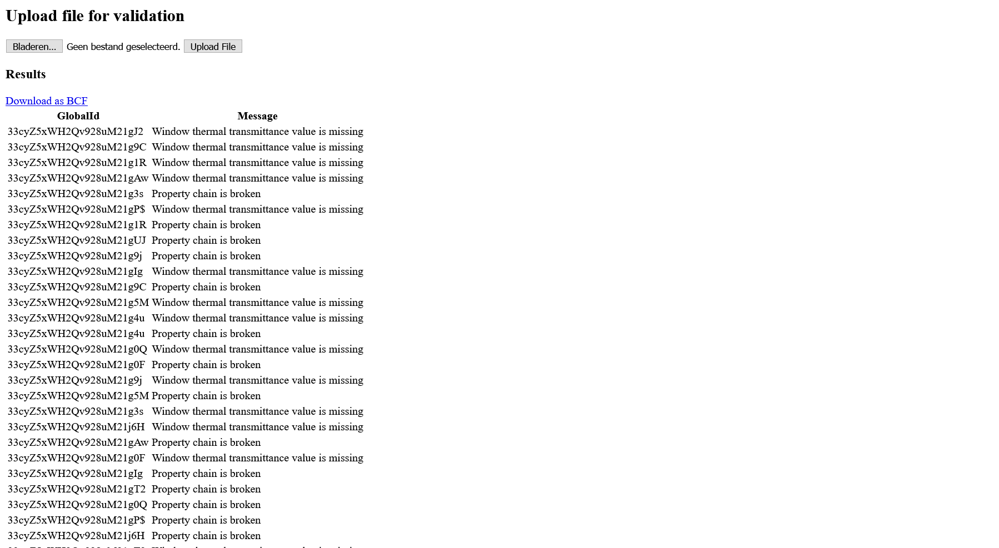

SHACL-based validation BIM Bot
==============================

Thomas Krijnen thomas@aecgeeks.com

An implementation of a BIM-Bot that accepts Linked-data serialized Bim4ren models, applies several [SHACL shapes](https://github.com/sbalot/BIM4Ren_SHACLDB) and returns output as a BCF. Can be ran as a BIM Bot or
HTML web-interface.

## Overview

* `invoke.py` invokes the running BIM bot and interactively shows the information exchange
* `main.py` the main Flask entrypoint and BCF serialization
* `run_validate.py` the functionality to invoke SHACL, parse the output and join with the input graph to construct {guid, message} pairs
* `templates/index.html` Jinja2 template for the HTML frontend
* `Dockerfile` for production usage of the server
* `run.sh` for building and running with the appropriate port binding
* `supervisord.conf` configuration of the programs for production usage
* `wsgi.py` WSGI wrapper for gunicorn

## Example usage

    $ python3 invoke.py
    > POST http://localhost HTTP/1.1
    > User-Agent: python-requests/2.22.0
    > Accept-Encoding: gzip, deflate
    > Accept: */*
    > Connection: keep-alive
    > Content-Length: 96189
    > Content-Type: application/json
    >
    > {'inputs': [{'identifier': 'BIM4Ren_DUNANT_cleaned_IFC2x3',
    >              'location': 'data:text/turtle;base64,QHByZWZpeCBnZW86ICAgPGh...',
    >              'schema': 'B4R',
    >              'type': 'RDF'}],
    >  'outputs': [{'location': 'embedded', 'schema': 'BCF_ZIP_2_0', 'type': 'FILE'}]}

    < Server: gunicorn
    < Date: Sat, 27 Mar 2021 11:28:19 GMT
    < Connection: close
    < Content-Type: application/json
    < Content-Length: 38842
    <
    < {'location': 'data:application/octet-stream;base64,UEsDBBQAAA...',
    <  'schema': 'BCF_ZIP_2_0',
    <  'type': 'FILE'}

    BCF contents:
    ./bcf.version
    ./4b0b257f-e9f6-46c0-8e7e-202474cae6df/markup.bcf
    ./4b0b257f-e9f6-46c0-8e7e-202474cae6df/Viewpoint_7e50795e-101a-40b8-9a3b-a89e6b370d2a.bcfv
    ./b265bbdf-8e2d-4432-b583-51977b55fdcd/markup.bcf
    ./b265bbdf-8e2d-4432-b583-51977b55fdcd/Viewpoint_a8764071-1b04-4e12-afe2-d4fab9ae88ae.bcfv
    
    

## Development

Use `python main.py` to spin op a development server with automatic code reloading.

## Production

The application can be deployed as a Docker file that runs supervisord to monitor the gunicorn web server and a process that polls for new changes in the repository of validation shapes. Building the Docker file and running with the appropriate port binding can be accomplished by running run.sh
